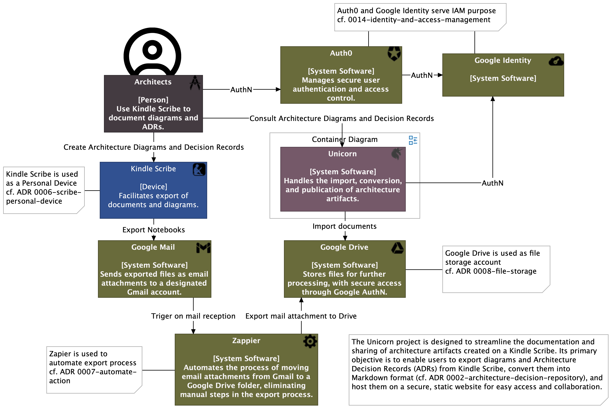
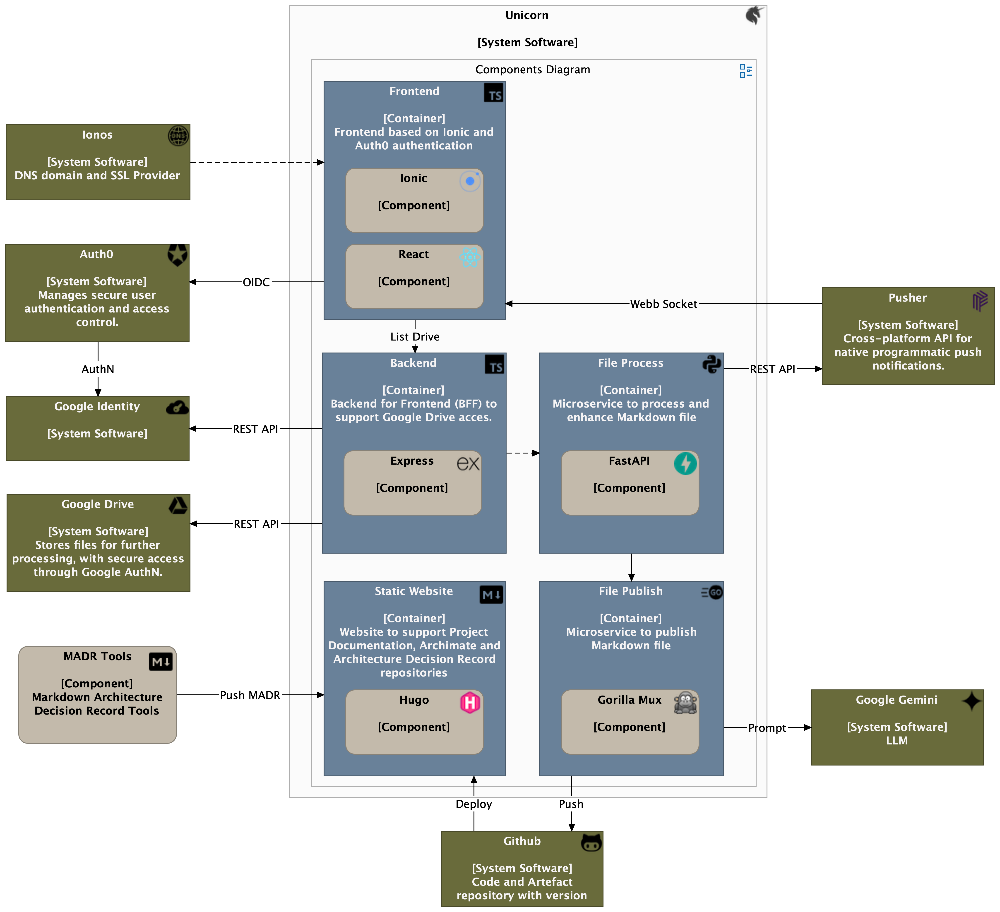

# unicorn-frontend
SPA based on Ionic for [Unicorn](https://unicorn.royerm.fr) project.
## Context
The Unicorn project is designed to streamline the documentation and sharing of architecture artifacts created on a Kindle Scribe. Its primary objective is to enable users to export diagrams and Architecture Decision Records (ADRs) from Kindle Scribe, convert them into Markdown format, and host them on a secure, static website for easy access and collaboration.



## System Software Overview
System Software rely on a Frontend/Backend pattern: 
- [Frontend](https://github.com/mickael-royer/unicorn-frontend/) developped on Ionic framework (cf. [ADR 0013-frontend-framework](https://hugo.royerm.fr/adr/0013-frontend-framework/))
- [Backend](https://github.com/mickael-royer/unicorn-backend) developped on Express framework (cf. [ADR 0015-backend-framework](https://hugo.royerm.fr/adr/0015-backend-framework/))



## Local .env variables settting
```
set -a; source .env; set +a
```

## Start Ionic Server
```
ionic serve
```
